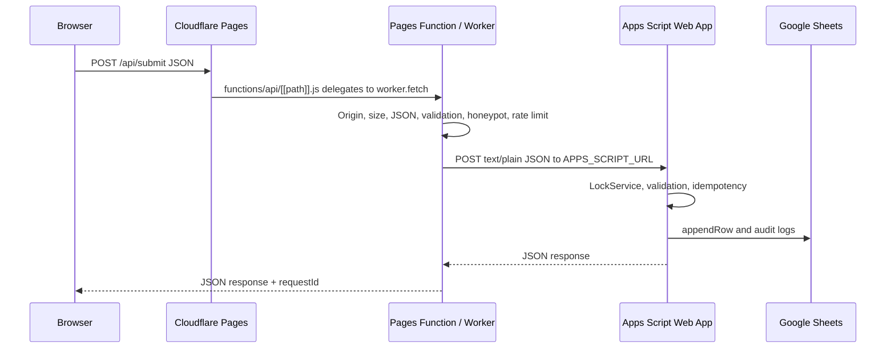

# Production Architecture

This project is a static Cloudflare Pages site with a single production form gateway:

```txt
Browser -> /api/submit Pages Function -> Worker module -> Google Apps Script -> Google Sheets
```

## Goals

| Goal | Implementation |
| --- | --- |
| Hide Apps Script URL | Browser posts only to `/api/submit`; `APPS_SCRIPT_URL` is a Cloudflare secret. |
| Correct tab per form | Worker and Apps Script normalize `quotation`, `roi`, `contact`, and `services`. |
| Idempotent retries | `X-Request-ID` flows through Worker and Apps Script dedupes by `Request_ID`. |
| No cached writes | `_headers` and Worker JSON responses set `no-store`. |
| Cloudflare-ready deploy | `npm run build` emits only deployable assets into `dist`. |

## Request Flow



## Key Files

| Path | Role |
| --- | --- |
| `index.html`, `calculator.html`, `quotation.html`, `contact.html`, `services.html` | Static frontend pages. |
| `api-client.js` | Shared browser submission client with retries, timeout, and JSON validation. |
| `script.js` | Quotation flow, PDF generation, quote save. |
| `roi.js` | ROI calculator, PDF generation, ROI save. |
| `contact.js`, `services.js` | Contact/service form behavior. |
| `workers/worker.js` | Edge validation, CORS/origin policy, rate limit, Apps Script forwarding. |
| `functions/api/[[path]].js` | Cloudflare Pages Function bridge to the Worker module. |
| `backend/backend.gs` | Google Apps Script sheet writer and audit logger. |
| `scripts/build.mjs` | Produces the deployable `dist` artifact. |
| `_headers`, `_redirects`, `_routes.json` | Cloudflare routing, cache, and security behavior. |

## Environment

| Name | Where | Secret | Notes |
| --- | --- | --- | --- |
| `APPS_SCRIPT_URL` | Pages Functions / Worker | Yes | Must end with `/exec`. |
| `VSS_API_ENDPOINT` | Build-time public config | No | Use `/api/submit` in production. |
| `RATE_LIMIT_REQUESTS` | Pages Functions / Worker | No | Default 30 per minute per IP. |
| `APPS_SCRIPT_TIMEOUT_MS` | Pages Functions / Worker | No | Default 25000. |
| `ALLOWED_ORIGINS` | Pages Functions / Worker | No | Leave unset for same-origin production; use exact origins for cross-origin. |
| `TURNSTILE_SECRET_KEY` | Pages Functions / Worker | Yes | Optional server-side token verification. |
| `TURNSTILE_REQUIRED` | Pages Functions / Worker | No | Set `true` only after adding frontend Turnstile tokens. |

## Deployment

1. Deploy Apps Script Web App with access set to **Anyone**.
2. Add `APPS_SCRIPT_URL` as a Cloudflare Pages secret.
3. Use build command `npm run build`.
4. Use output directory `dist`.
5. Deploy with `npm run deploy` or the Cloudflare dashboard.
6. Smoke-test `/api/health`, then submit one contact, service, ROI, and quotation record.

## Debugging

| Symptom | Likely Cause | Check |
| --- | --- | --- |
| HTML/non-JSON from `/api/submit` | Static server or route miss | Open the site from Wrangler/Cloudflare Pages, not a plain static server. |
| `403 ORIGIN_NOT_ALLOWED` | Cross-origin request not allowlisted | Set exact `ALLOWED_ORIGINS` only when cross-origin is intentional. |
| `413 PAYLOAD_TOO_LARGE` | JSON body over 32KB | Keep PDFs/files out of form JSON. |
| `415 INVALID_CONTENT_TYPE` | Missing `application/json` | Use `api-client.js` or correct fetch headers. |
| `502 BAD_BACKEND_RESPONSE` | Apps Script returned HTML | Redeploy Apps Script Web App and verify `/exec` URL. |
| Duplicate rows | Missing/stale request id | Check `Submission_Log` and sheet columns B/C. |

## Security Controls

- Apps Script URL is never exposed to browser JavaScript.
- Origin policy defaults to same-origin.
- Payload size and text fields are bounded.
- Honeypot fields are filtered.
- Optional Turnstile verification is supported.
- CSP, frame, MIME, referrer, and permissions headers are defined in `_headers`.
- Request IDs are propagated for auditability.
