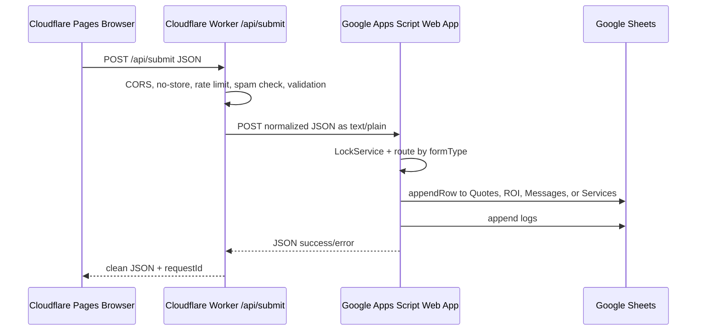

# Production Form System

This project now uses a three-layer form architecture:



## Why This Architecture

Cloudflare Pages is static hosting, so the frontend must not contain secrets and must not depend on direct Apps Script CORS behavior. The Worker is the production API boundary. It keeps the Apps Script URL private, validates payloads at the edge, disables caching for submissions, absorbs browser CORS/preflight problems, and gives every request a traceable ID.

Google Apps Script is kept small and deterministic. It receives one normalized contract from the Worker, locks before writing, creates required tabs/headers, routes by `formType`, appends one row, and writes audit/error logs. Future forms only need one new route definition and one row builder.

## Request Contract

Endpoint:

```txt
POST /api/submit
Content-Type: application/json
Cache-Control: no-store
```

Payload:

```json
{
  "formType": "quotation",
  "sourcePage": "quotation.html",
  "turnstileToken": "",
  "data": {
    "name": "Customer Name",
    "phone": "9876543210",
    "email": "name@example.com",
    "plantSize": "5 kW"
  }
}
```

Valid `formType` values:

```txt
quotation
roi
contact
services
```

Response:

```json
{
  "success": true,
  "recordId": "VSQ-20260514-ABC123",
  "requestId": "REQ_MA...",
  "message": "Submission saved successfully."
}
```

## Frontend Usage

The existing static frontend uses `api-client.js` and `window.VSS_API.submitLead(...)`. It now posts to `window.VSS_CONFIG.apiEndpoint`, defaulting to `/api/submit`.

All production forms use `api-client.js`, which provides timeout handling, retries for transient failures, duplicate in-flight suppression, payload normalization, and clear non-JSON route diagnostics.

## Google Sheets

Create one spreadsheet and deploy `backend/backend.gs` into its Apps Script project. Replace:

```js
const SPREADSHEET_ID = 'PASTE_YOUR_SPREADSHEET_ID_HERE';
```

Required tabs are auto-created by visiting:

```txt
https://script.google.com/macros/s/YOUR_DEPLOYMENT_ID/exec?action=setup
```

Tabs:

```txt
Quotes
ROI
Messages
Services
Submission_Log
Error_Log
```

The first four tabs store business data. `Submission_Log` tracks every accepted/retried/error request. `Error_Log` stores validation, JSON, permission, and append failures.

## Cloudflare Pages Functions Deployment

The production path is Cloudflare Pages with the included Pages Function at `functions/api/[[path]].js`.

1. Add secret `APPS_SCRIPT_URL` to the Pages project.
2. Keep the public endpoint as `/api/submit`.
3. Build with `npm run build`.
4. Deploy the `dist` output with `npm run deploy` or the Cloudflare dashboard.

Do not store the Apps Script URL in frontend `.env` files. It belongs only in Cloudflare secrets.

Optional Turnstile:

```bash
wrangler secret put TURNSTILE_SECRET_KEY
```

Then send the browser token as `turnstileToken`.

## Cloudflare Pages Deployment

Frontend env:

```txt
VSS_API_ENDPOINT=/api/submit
```

Build command:

```txt
npm run build
```

Output directory:

```txt
dist
```

The `_headers` file sets `connect-src 'self'` and `Cache-Control: no-store` for `/api/*`. POST requests are not cached by Cloudflare by default, and the Worker also returns explicit no-store headers.

## Debugging Checklist

Common failure points:

- CORS: browser calls Apps Script directly, missing `Access-Control-Allow-Origin`, or failing OPTIONS preflight. Fix by calling `/api/submit`.
- Malformed JSON: wrong `Content-Type`, invalid JSON body, or sending `FormData` directly. Fix by sending `application/json`.
- Wrong Apps Script deployment: old deployment URL, not redeployed after code change, or "Who has access" not set to Anyone.
- Sheet permissions: Apps Script account cannot open `SPREADSHEET_ID`.
- Invalid tab names: tabs renamed manually. Run `?action=setup`.
- Apps Script quota: too many writes or MailApp sends. Check Apps Script executions.
- Non-JSON backend response: Apps Script threw before `jsonResponse`, or Google returned an auth HTML page.
- Cloudflare route miss: `/api/submit` is served by Pages fallback instead of Worker. Check Worker route pattern.
- Cache confusion: stale `env-config.js`. It is set to `max-age=0, must-revalidate`.
- Validation mismatch: Worker requires `quotation.name/phone/plantSize`, `roi.name/phone/monthlyElectricityBill`, `contact.name/phone/message`, `services.name/phone/issueDescription`.
- Response parsing: frontend assumes success on HTTP 200 only. It must check `json.success`.

Fast tests:

```bash
curl -i https://yourdomain.com/api/health
curl -i https://yourdomain.com/api/submit \
  -H "Content-Type: application/json" \
  -d "{\"formType\":\"contact\",\"data\":{\"name\":\"Test\",\"phone\":\"9876543210\",\"message\":\"Hello\"}}"
```

## Security

Recommended hardening:

- Keep `APPS_SCRIPT_URL` as a Worker secret.
- Leave `ALLOWED_ORIGINS` unset for same-origin production, or set exact origins only when cross-origin API calls are required.
- Add Cloudflare Turnstile to public forms.
- Keep honeypot fields named `website` or `companyWebsite`.
- Enable Cloudflare WAF/rate limiting rules for `/api/submit`.
- Use KV-backed rate limiting for multi-isolate consistency.
- Avoid sending sensitive personal data into browser logs.
- Use exact Worker routes and do not expose Apps Script in `env-config.js`.

## Performance and Scale

The payload is intentionally small JSON. The UI stays non-blocking with loading/error states and retries only network/5xx/429 failures. The Worker runs at the edge and does not cache submissions. Apps Script writes are serialized with `LockService` to prevent concurrent append issues.

Future scaling path:

```txt
Cloudflare Pages -> Worker -> Queue -> Worker Consumer -> Sheets/CRM/DB/Webhooks
```

Add a queue when traffic grows beyond Apps Script comfort limits. Add D1/Supabase/Firebase as the source of truth when you need dashboards, analytics, search, user accounts, or CRM workflows. Keep the browser contract unchanged so future backends can be swapped without breaking the UI.
